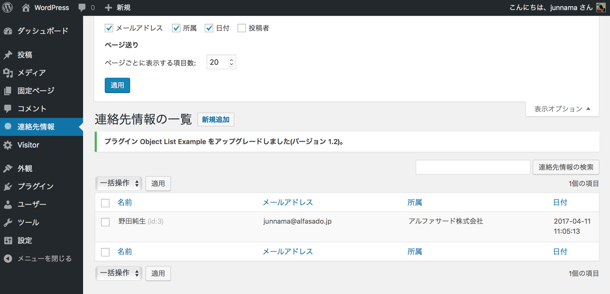

# List Base Object \- plugin for WordPress

This plugin provides the function to add table and show list and edit screen to WordPress\.

1. Install List Base Object plugin /wp\-content/plugins/list\-base\-object/list\-base\-object\.php\.
2. Add some Class extends ListBaseObject and ListBaseObjectInit Classes\.

##  Screenshot

##  Custom Class\(es\)

    <php?
    /*
    Plugin Name: Object List Example
    Plugin URI: https://alfasado.net/
    Description: Example for List Base Object.
    Version: 0.1
    Author: Alfasado Inc.
    Author URI: https://alfasado.net/
    License: GPL2
    */

    $plugin_id = 'ObjectListExample';
    load_plugin_textdomain( 'object-list-example', false, basename( dirname( __FILE__ ) ) . '/languages' );
    require_once( ABSPATH . 'wp-content/plugins/list-base-object/list-base-object.php' );
    class ObjectListExample extends ListBaseObject {
        public $plugin_key   = 'objectlistexample';   // Uniqkey for upgrade table
        public $version      = 1.1;                   // Version for upgrade table
        public $singular     = 'Contact Info';        // Object label
        public $plural       = 'Contact Info';        // Object label plural
        public $_table       = 'contact_info';        // Database table name
        public $_primary     = 'ID';                  // Primary key for table
        public $_title       = 'name';                // Title column for list & edit screen
        public $_display     = true;                  // Can view list screen
        public $_can_upgrade = true;                  // Can create or upgrade table
        public $_can_edit    = true;                  // Can edit, save or delete object(s)
        public $_can_search  = true;                  // Display search box
        public $list_options = true;                  // Show display options
        public $textdomain   = 'object-list-example'; // Labguage text domain
        public $permission   = 'activate_plugins';    // Permission for this action(s)
        protected $_filter   = '';                    // Add query for get list objects, ex "post_type='post'"
        public $icon_url     = 'images/icon.png';     // Add icon to menu item
        public $menu_type    = 'object';              // Placement of menu item
        public $menu_order   = 1;                     // Position of menu item( when $menu_type='menu' )
        public function __path() {
            return __FILE__;
        }
        function column_defs(){
            $columns = array(
            // Array Table scheme and property for list screen
                'name'    => array( 'label' => 'Name',  // Label for list and edit screen.
                                    'list' => true,     // Show column for list screen
                                    'edit' => true,     // Show column for edit screen
                                    'search' => true,   // Search this column
                                    'type' => 'string', // Control type for edit screen
                                    'indexed' => true,  // Add index to this column
                                    'property' => "varchar(50) NOT NULL DEFAULT ''", // SQL for CREATE or ALTER TABLE
                                  ),
            // ...
            );
            return $columns;
        }
    }
    $init_plugin = $plugin_id . 'Init';
    new $init_plugin; // Initialize Plugin
    class ObjectListExampleInit extends ListBaseObjectInit {
        // Class for add menu and display screen
    }
    
